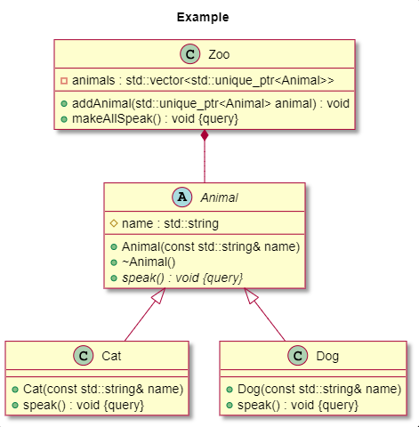

# UML Generator for C++ Headers

This project provides a Docker-based setup to generate UML diagrams from C++ header files (.h and .hpp) using hpp2plantuml. The UML diagrams are output in PlantUML format (.puml). The template used follows Jinja syntax, allowing for customization of the generated diagrams.

## Project Structure

- Dockerfile: Configures the Docker image with the required dependencies.
- template.puml: Custom Jinja template to prepend headers to each .puml file.
- entrypoint.sh: Script to execute hpp2plantuml for each header file and generate UML diagrams.
- utils.sh: Contains helper functions for building and running the Docker container.

## Requirements

- Docker installed on your system.
- Access to a C++ project with header files.

## Template Customization

The `template.puml` file uses Jinja syntax to add a preamble to each .puml file generated. Here’s how the template works:

```jinja



title "Add title here"
skin rose

```

This template defines a title and a skin style for all UML diagrams. You can further customize these settings by modifying template.puml.

## Usage

### 1. Build the Docker Image

To set up the Docker container with all dependencies, navigate to the project directory and build the image:

```bash
source utils.sh
build_dev_image
```

### 2. Generate UML Diagrams

The generate_uml function in utils.sh runs the Docker container to generate UML diagrams based on your specified input and output directories.
Usage

```bash
generate_uml <input_directory> [output_directory]
```

- input_directory: The path to the directory containing the C++ header files.
- output_directory (optional): The path to save the generated .puml files. If not specified, the output defaults to the current directory.

#### Example

```bash
generate_uml /path/to/your/cpp_project/include /path/to/output_directory
```

This command will:

- Mount input_directory to the Docker container.
- Run hpp2plantuml on each .h and .hpp file in the directory.
- Save the generated .puml files to the specified output_directory (or the current directory if not provided).




### 3. Verify Output

The .puml files generated will be located in the specified output directory, with each file containing the specified title and skin style from template.puml.

## Additional Notes

- To customize the title or skin, edit template.puml before running the Docker container.
- Ensure that your directory paths are accessible to Docker, particularly if running on Linux, as you may need elevated permissions or adjusted file permissions.
